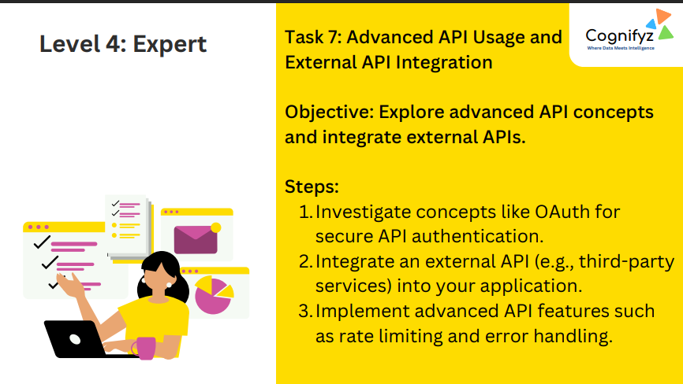
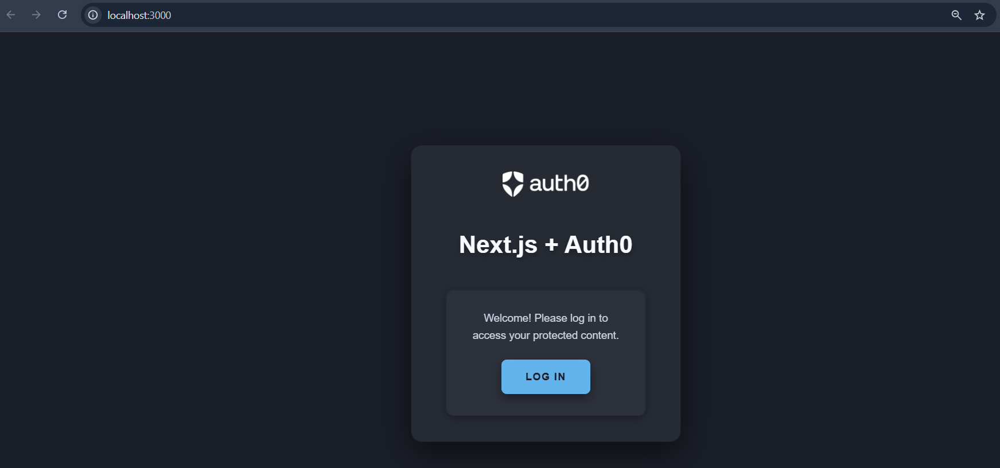

# Level 4: Expert – Task 7: Advanced API Usage and External API Integration

---

## Task 7 Overview

**Objective:**  
Explore advanced API concepts and integrate external APIs.

---

## Steps (as per task)

1. **Investigate concepts like OAuth for secure API authentication.**
2. **Integrate an external API (e.g., third-party services) into your application.**
3. **Implement advanced API features such as rate limiting and error handling.**

---

## What’s Implemented (Based on Screenshots)

### 1) OAuth Authentication (Auth0)
- The project uses **Auth0** to authenticate users via OAuth/OpenID Connect.
- A **Next.js + Auth0** interface is set up with a **Log In** button.
- Protected content is intended to be accessible only after successful login.

### 2) External API Integration (Concept / Extension)
- After authentication, the application can securely call external/third‑party APIs using access tokens.
- Typical examples include fetching user profile data, calling an API gateway, or integrating with services like GitHub, Google APIs, etc.

### 3) Advanced API Practices (Planned/Expected)
- **Rate limiting** to protect endpoints from abuse.
- **Error handling** for consistent API responses (e.g., standardized error messages and status codes).

---

## Output

- 
