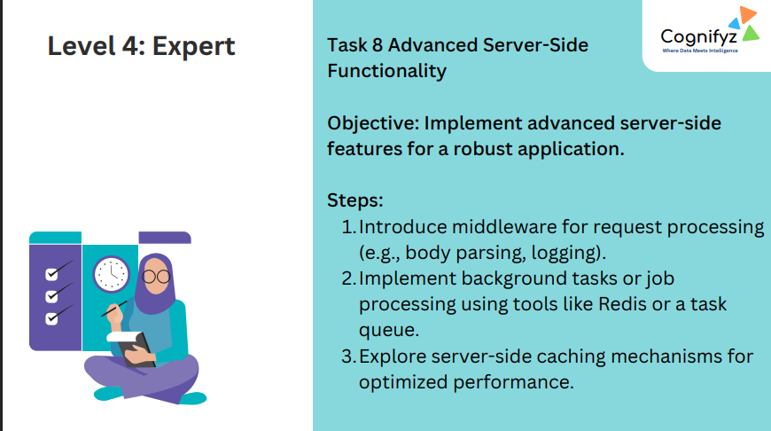
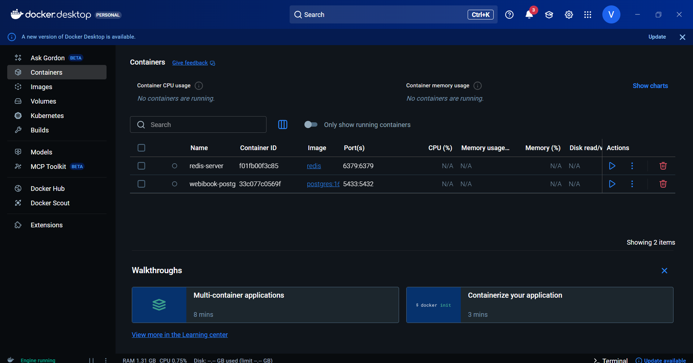
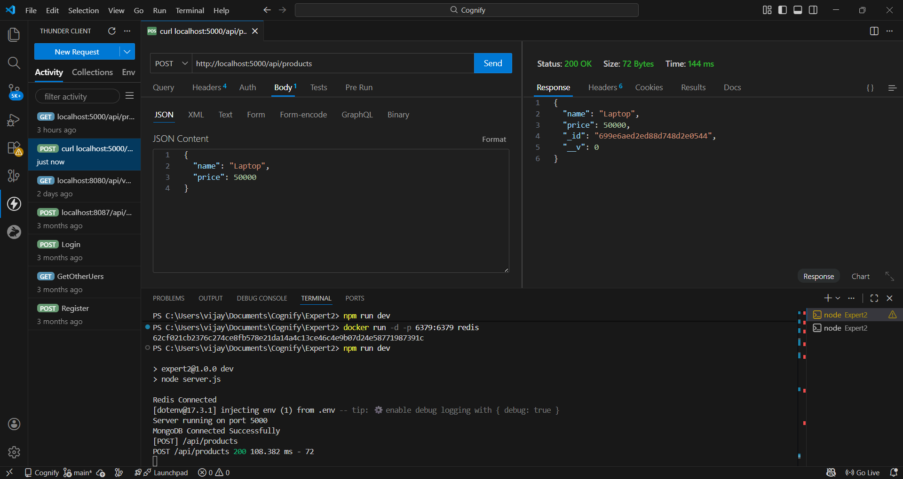
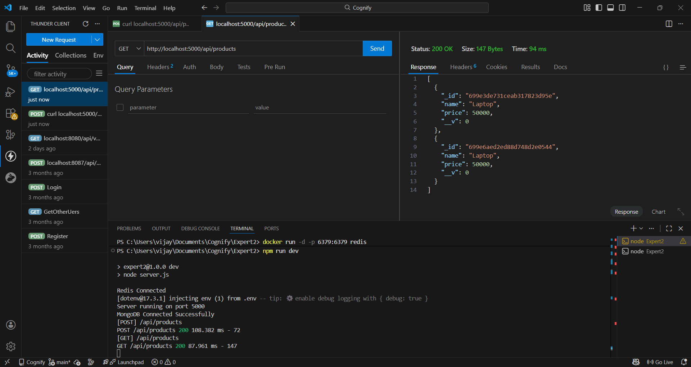

# Level 4: Expert – Task 8: Advanced Server-Side Functionality

---

## Task 8 Overview

**Objective:**  
Implement advanced server-side features for a robust application.

---

## Steps (as per task)

1. **Introduce middleware for request processing** (e.g., body parsing, logging).
2. **Implement background tasks or job processing** using tools like Redis or a task queue.
3. **Explore server-side caching mechanisms** for optimized performance.

---

## What’s Implemented (Based on Screenshots)

### 1) Middleware & Server Setup
- The backend server is running locally (shown running on **port 5000**).
- Request handling is working for API routes (successful `200 OK` responses for POST/GET).

### 2) Background / Queue Support with Redis (Docker)
- Redis is running in a Docker container (`redis-server`) exposed on **6379:6379**.
- This enables queue-like functionality, background jobs, or caching support.

### 3) Database Connectivity
- MongoDB connection is shown as **connected successfully** in the terminal logs.
- Products data is being stored and retrieved from the database.

### 4) CRUD API Demonstration (Thunder Client / REST Client)

#### Create Product (POST)
- Endpoint tested: `POST http://localhost:5000/api/products`
- Example payload includes:
  - `name: "Laptop"`
  - `price: 50000`
- Response confirms the created object with an `_id`.

#### Fetch Products (GET)
- Endpoint tested: `GET http://localhost:5000/api/products`
- Response returns an array of products stored in the database.

---

## Output

--- 

--- 

