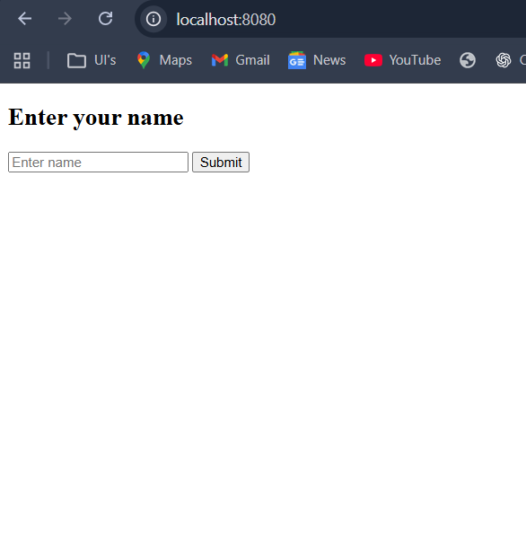

# Level 1: Beginner – HTML Structure and Basic Server Interaction


## Task 1: HTML Structure and Basic Server Interaction

### Objective
Introduce the concept of server-side rendering and basic form submissions.

---

### Steps

1. **Create an HTML structure with forms for user input.**
   - Build a form where users can enter their name.

2. **Set up a simple Node.js server using Express.**
   - Use Express to serve the form and handle requests.

3. **Create server-side endpoints to handle form submissions.**
   - Implement endpoints to receive form data via POST requests.

4. **Use server-side rendering (e.g., EJS) to dynamically generate HTML.**
   - Render dynamic pages using EJS templates based on user input.

---

## Example Files

### form.ejs
```html
<!DOCTYPE html>
<html lang="en">
<head>
    <meta charset="UTF-8">
    <meta name="viewport" content="width=device-width, initial-scale=1.0">
    <title>Document</title>
</head>
<body>
      <h2>
        Enter your name
      </h2>

      <form action="/submit"
      method="post"
      >
            <input type="text"
            name="userName"
            placeholder="Enter name"
            required 
            >
            <button
             type="submit"
            >
                Submit
            </button>
      </form>
</body>
</html>
```

### result.ejs
```html
<!DOCTYPE html>
<html lang="en">
<head>
    <meta charset="UTF-8">
    <meta name="viewport" content="width=device-width, initial-scale=1.0">
    <title>Result</title>
</head>
<body>
    <h2>
         Form Submitted successully
    </h2>
    <p>
        Hellow, <%= name %> 
    </p>
    <a href="/">Go back</a>
</body>
</html>
```

---

## Output

> **Paste your output (screenshot or description) here:**

---

## Reference

- 
- Cognifyz – Where Data Meets Intelligence
