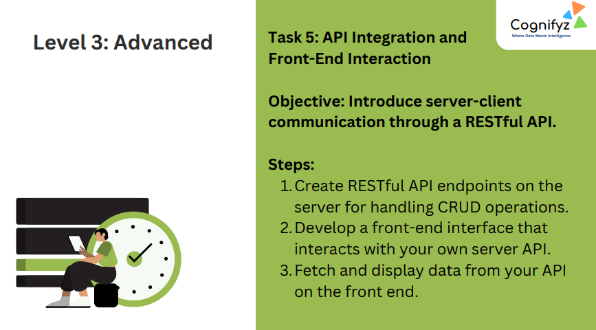
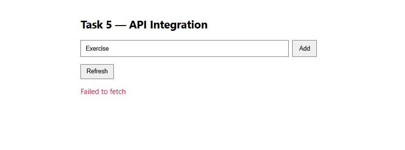

# Level 3: Advanced – Task 5: API Integration and Front-End Interaction

---

## Task 5 Overview

**Objective:**  
Introduce server-client communication through a RESTful API.

---

### Steps

1. **Create RESTful API endpoints on the server for handling CRUD operations.**
2. **Develop a front-end interface that interacts with your own server API.**
3. **Fetch and display data from your API on the front end.**

---

## Features Demonstrated

- **API Integration UI**  
  - Input and Add button to submit "Exercise" tasks.
  - Refresh button to fetch and display updated data.
- **Front-End and Back-End Communication**  
  - Connects to a RESTful API for managing data.
  - UI updates as data is fetched or added.

---

## Output

