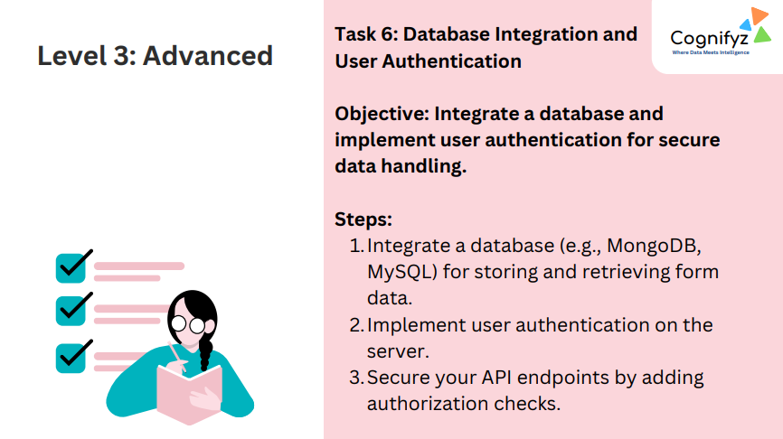
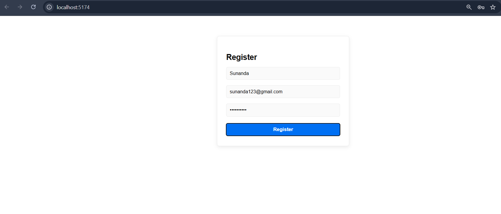
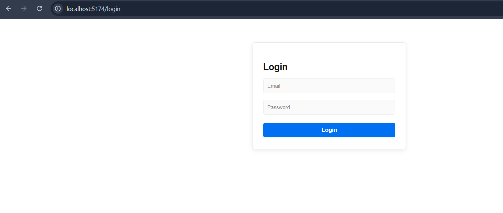
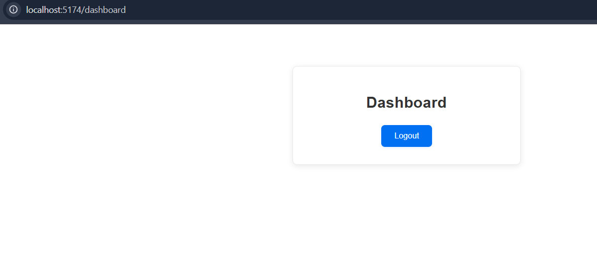
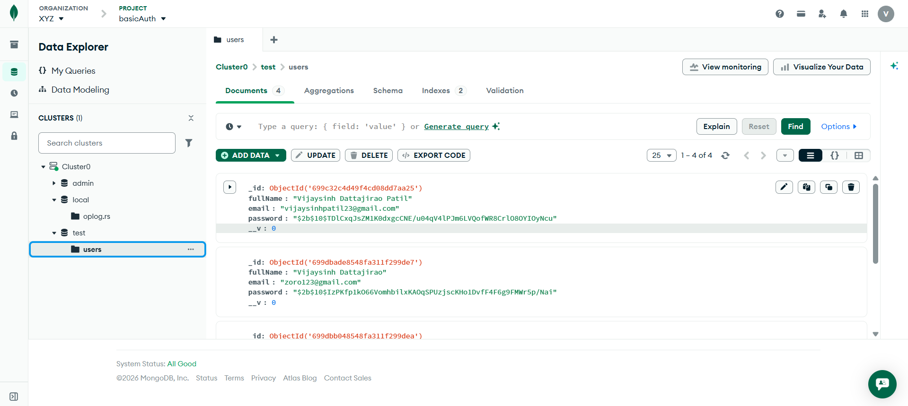

# Level 3: Advanced – Task 6: Database Integration and User Authentication

---

## Task 6 Overview

**Objective:**  
Integrate a database and implement user authentication for secure data handling.

---

## Steps (as per task)

1. **Integrate a database (e.g., MongoDB, MySQL) for storing and retrieving form data.**
2. **Implement user authentication on the server.**
3. **Secure your API endpoints by adding authorization checks.**

---

## What’s Implemented (Based on Screenshots)

### 1) Database Integration (MongoDB)
- A MongoDB database is connected and storing user records.
- A `users` collection contains documents with fields like:
  - `fullName`
  - `email`
  - `password` (stored as a hashed value)
- Data can be viewed in MongoDB Atlas/Data Explorer.

### 2) User Registration UI
- A **Register** page is created with:
  - Name field
  - Email field
  - Password field
  - Register button

### 3) User Login UI
- A **Login** page is created with:
  - Email field
  - Password field
  - Login button

### 4) Secure Authentication Flow (Expected)
- Users register → data is validated → stored in DB.
- Users login → credentials are verified.
- After login, protected API routes/pages can be accessed only if authorized.

---

## Output

