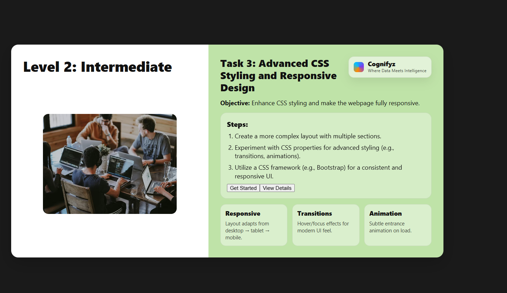

# Level 2: Intermediate – Task 3: Advanced CSS Styling and Responsive Design

---

## Task 3: Advanced CSS Styling and Responsive Design

### Objective
Enhance CSS styling and make the webpage fully responsive.

---

### Steps

1. **Create a more complex layout with multiple sections.**
2. **Experiment with CSS properties for advanced styling (e.g., transitions, animations).**
3. **Utilize a CSS framework (e.g., Bootstrap) for a consistent and responsive UI.**

---

### Key Features

- **Responsive**: Layout adapts from desktop → tablet → mobile.
- **Transitions**: Hover and focus effects for a modern UI feel.
- **Animation**: Subtle entrance animation on load.

---

### Example Buttons

- `Get Started`
- `View Details`

---

## Output

- 
- 
