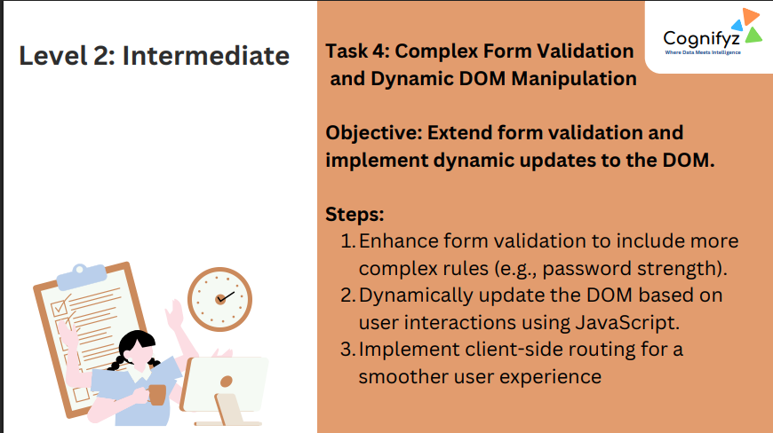
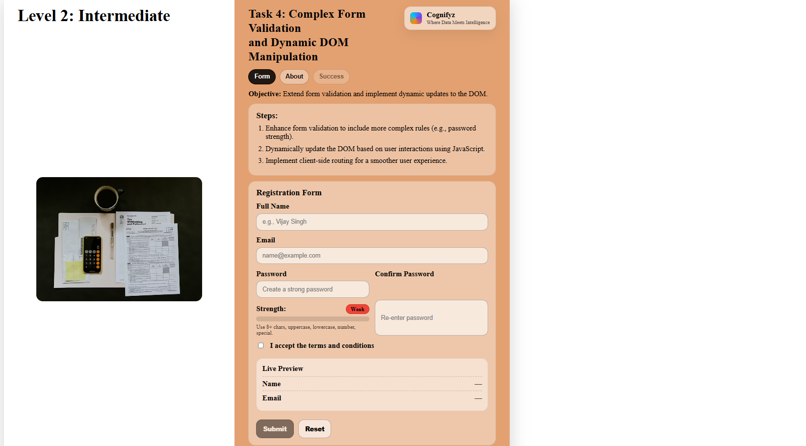

# Level 2: Intermediate – Task 4: Complex Form Validation and Dynamic DOM Manipulation

---

## Task 4 Overview

**Objective:**  
Extend form validation and implement dynamic updates to the DOM.

---

### Steps

1. **Enhance form validation to include more complex rules (e.g., password strength).**
2. **Dynamically update the DOM based on user interactions using JavaScript.**
3. **Implement client-side routing for a smoother user experience.**

---

## Features Demonstrated

- **Registration form** with fields for:
  - Full Name
  - Email
  - Password and Confirm Password with live strength indicator
  - Acceptance of terms and conditions
- **Password strength** is validated and indicated as the user types.
- **Live Preview** section displays entered name and email in real-time.
- **Dynamic feedback** for password criteria and form validity.
- **Submit and Reset** buttons.
- **Tabbed navigation** (Form, About, Success) for better user experience.

---

## Output
 

